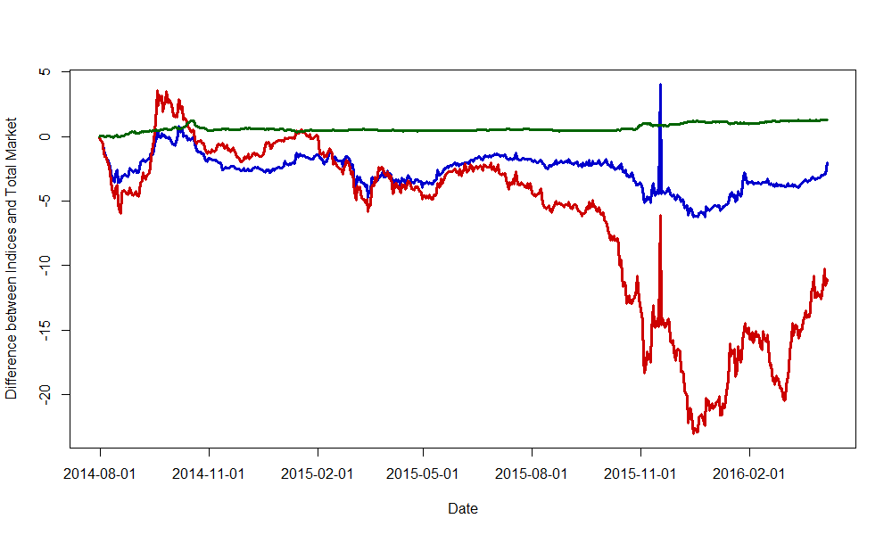

[](http://quantlet.de/index.php?p=info)

## [](http://quantlet.de/) **CRIXfamdiff** [](http://quantlet.de/d3/ia)

```yaml

Name of Quantlet : CRIXfamdiff

Published in : CRIX - a CRyptocurrency IndeX

Description : 'CRIXfamdiff gives a plot which shows the differences between the indices in the CRIX
family and the total market.'

Keywords : CRIX, ECRIX, EFCRIX, index, cryptocurrency, crypto, plot

See also : 'CRIXindex, ECRIXindex, EFCRIXindex, CRIXfamdiffloss, DAXCRIXloss, CRIXhnoptions,
CRIXoutmarket, CRIXoutmarketTERES, CRIXvarreturn'

Author : Simon Trimborn

Submitted : Fri, December 12 2015 by Simon Trimborn

Datafile : crix.csv, ecrix.csv, efcrix.csv, crix_all.csv

Example : Plot of the differences between the CRIX family indices and the total market.

```




```r
rm(list = ls(all = TRUE))
graphics.off()

# please change your working directory 
# setwd('C:/...')

crix        = read.csv("crix.csv", header = FALSE)
crix_all    = read.csv("crix_all.csv", header = FALSE)
ecrix       = read.csv("ecrix.csv", header = FALSE)
efcrix      = read.csv("efcrix.csv", header = FALSE)
crix$V1     = as.character(crix$V1)
crix_all$V1 = as.character(crix_all$V1)
ecrix$V1    = as.character(ecrix$V1)
efcrix$V1   = as.character(efcrix$V1)

last_substr       = substr(crix$V1, (nchar(crix$V1[1]) - 4), 
  (nchar(crix$V1[1]) - 3))
last_substr_which = which(last_substr != c(last_substr[-1], 
  tail(last_substr, n = 1))) + 1
last_substr_which = c(1, last_substr_which)
names_crix        = crix$V1[last_substr_which]

plot(crix_all[, 2] - crix[, 2], type = "l", col = "blue3", xaxt = "n", lwd = 3, 
  xlab = "Date", ylab = "Difference between Indices and Total Market", 
  ylim = c(min(crix_all[, 2] - crix[, 2], crix_all[, 2] - ecrix[, 2], 
  crix_all[, 2] - efcrix[, 2]), max(crix_all[, 2] - crix[, 2], crix_all[, 2] - 
  ecrix[, 2], crix_all[, 2] - efcrix[, 2])))
lines(crix_all[, 2] - ecrix[, 2], type = "l", col = "red3", lwd = 3)
lines(crix_all[, 2] - efcrix[, 2], type = "l", col = "darkgreen", lwd = 3)
axis(1, at = last_substr_which, label = names_crix)

```
