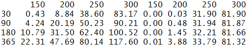

[](http://quantlet.de/index.php?p=info)

## [](http://quantlet.de/) **CRIXhnoptions** [](http://quantlet.de/d3/ia)

```yaml

Name of Quantlet : CRIXhnoptions

Published in : CRIX - a CRyptocurrency IndeX

Description : 'CRIXhnoptions provides a matrix that show the prices of Heston Nandi Put Options for
different Strikes and different times to maturity. The prices are provided for CRIX and S&P500.
Heston and Nandi proposed in their paper "A Closed-Form GARCH Option Valuation Model" a purely
stock price based option valuation model. Since for the CRIX doesn''t exist any options, the
volatility can''t be computed from other options. This drawback requires an approach which works
without option data. The prices of the S&P500 has been adjusted such that the last price is the
same than for the CRIX. By this procedure, the two time series become comparable for different
Strikes and Maturities.'

Keywords : CRIX, index, cryptocurrency, crypto, plot, S&P500, option, put, heston, GARCH

See also : CRIXindex, CRIXoutmarket, CRIXoutmarketTERES, CRIXvarreturn

Author : Simon Trimborn

Submitted : Fri, December 04 2015 by Simon Trimborn

Datafile : crix.csv, SP500_index.csv

Example : 'A matrix that show the prices of Heston Nandi Put Options for different Strikes
(columns) and different times to maturity (rows). The prices are provided for CRIX (left part of
matrix) and S&P500 (right part of matrix).'

```




```r
rm(list=ls(all=TRUE))

# please change your working directory
#setwd("C:/...")

# install and load packages
libraries = c("fOptions")
lapply(libraries, function(x) if (!(x %in% installed.packages())) {
  install.packages(x)
})
lapply(libraries, library, quietly = TRUE, character.only = TRUE)
#
plot_crix   = read.csv("crix.csv", header = T, row.names = 1)
index_SP500 = read.csv("SP500_index.csv", header = T)
#
sp_div                = tail(index_SP500$Price, n = 1) / 
  tail(plot_crix$Price, n = 1)
index_SP500_corrected = index_SP500$Price/sp_div
SP500_returns         = diff(log(index_SP500_corrected))
crix_returns          = diff(log(plot_crix$Price))
#
HNfit1 = hngarchFit(crix_returns[-length(crix_returns)], 
  model = list(lambda = -0.5, 
  omega = var(crix_returns[-length(crix_returns)]), 
  alpha = 0.1 * var(crix_returns[-length(crix_returns)]), beta = 0.1, 
  gamma = 0, rf = 0.0001))
HNfit2 = hngarchFit(crix_returns[-length(crix_returns)], 
  model = list(lambda = -0.5, 
  omega = var(crix_returns[-length(crix_returns)]), 
  alpha = 0.1 * var(crix_returns[-length(crix_returns)]), beta = 0.1, 
  gamma = 0, rf = 0.0002))
HNfit3 = hngarchFit(crix_returns[-length(crix_returns)], 
  model = list(lambda = -0.5, 
  omega = var(crix_returns[-length(crix_returns)]), 
  alpha = 0.1 * var(crix_returns[-length(crix_returns)]), beta = 0.1, 
  gamma = 0, rf = 0.0009))
HNfit4 = hngarchFit(crix_returns[-length(crix_returns)], 
  model = list(lambda = -0.5, 
  omega = var(crix_returns[-length(crix_returns)]), 
  alpha = 0.1 * var(crix_returns[-length(crix_returns)]), beta = 0.1, 
  gamma = 0, rf = 0.0024))
#
HNfit5 = hngarchFit(SP500_returns[-length(SP500_returns)], 
  model = list(lambda = -0.5, 
  omega = var(SP500_returns[-length(SP500_returns)]), 
  alpha = 0.1 * var(SP500_returns[-length(SP500_returns)]), beta = 0.1, 
  gamma = 0, rf = 0.0001))
HNfit6 = hngarchFit(SP500_returns[-length(SP500_returns)], 
  model = list(lambda = -0.5, 
  omega = var(SP500_returns[-length(SP500_returns)]), 
  alpha = 0.1 * var(SP500_returns[-length(SP500_returns)]), beta = 0.1, 
  gamma = 0, rf = 0.0002))
HNfit7 = hngarchFit(SP500_returns[-length(SP500_returns)], 
  model = list(lambda = -0.5, 
  omega = var(SP500_returns[-length(SP500_returns)]), 
  alpha = 0.1 * var(SP500_returns[-length(SP500_returns)]), beta = 0.1, 
  gamma = 0, rf = 0.0009))
HNfit8 = hngarchFit(SP500_returns[-length(SP500_returns)], 
  model = list(lambda = -0.5, 
  omega = var(SP500_returns[-length(SP500_returns)]), 
  alpha = 0.1 * var(SP500_returns[-length(SP500_returns)]), beta = 0.1, 
  gamma = 0, rf = 0.0024))
#
K                    = c(150, 200, 250, 300)
time_option          = c(30, 90, 180, 365)
put_matrix           = matrix(NA, nrow = length(time_option), 
  ncol = length(K) * 2)
for (j in 1:length(K)){
  put_matrix[1,j] = HNGOption(TypeFlag = "p", model = HNfit1$model, 
    S = tail(plot_crix$Price, n = 1), X = K[j], 
    Time.inDays = time_option[1], 
    r.daily = HNfit1$model[[6]] / time_option[1])$price
  put_matrix[2,j] = HNGOption(TypeFlag = "p", model = HNfit2$model, 
    S = tail(plot_crix$Price, n = 1), X = K[j], 
    Time.inDays = time_option[2], 
    r.daily = HNfit2$model[[6]] / time_option[2])$price
  put_matrix[3,j] = HNGOption(TypeFlag = "p", model = HNfit3$model, 
    S = tail(plot_crix$Price, n = 1), X = K[j], 
    Time.inDays = time_option[3], 
    r.daily = HNfit3$model[[6]] / time_option[3])$price
  put_matrix[4,j] = HNGOption(TypeFlag = "p", model = HNfit4$model, 
    S = tail(plot_crix$Price, n = 1), X = K[j], 
    Time.inDays = time_option[4], 
    r.daily = HNfit4$model[[6]] / time_option[4])$price
#  
  put_matrix[1,j+4] = HNGOption(TypeFlag = "p", model = HNfit5$model, 
    S = tail(index_SP500_corrected, n = 1), X = K[j], 
    Time.inDays = time_option[1], 
    r.daily = HNfit5$model[[6]] / time_option[1])$price
  put_matrix[2,j+4] = HNGOption(TypeFlag = "p", model = HNfit6$model, 
    S = tail(index_SP500_corrected, n = 1), X = K[j], 
    Time.inDays = time_option[2], 
    r.daily = HNfit6$model[[6]] / time_option[2])$price
  put_matrix[3,j+4] = HNGOption(TypeFlag = "p", model = HNfit7$model, 
    S = tail(index_SP500_corrected, n = 1), X = K[j], 
    Time.inDays = time_option[3], 
    r.daily = HNfit7$model[[6]] / time_option[3])$price
  put_matrix[4,j+4] = HNGOption(TypeFlag = "p", model = HNfit8$model, 
    S = tail(index_SP500_corrected, n = 1), X = K[j], 
    Time.inDays = time_option[4], 
    r.daily = HNfit8$model[[6]] / time_option[4])$price
}
colnames(put_matrix) = c(K, K)
rownames(put_matrix) = time_option
round(put_matrix, 2)

```
