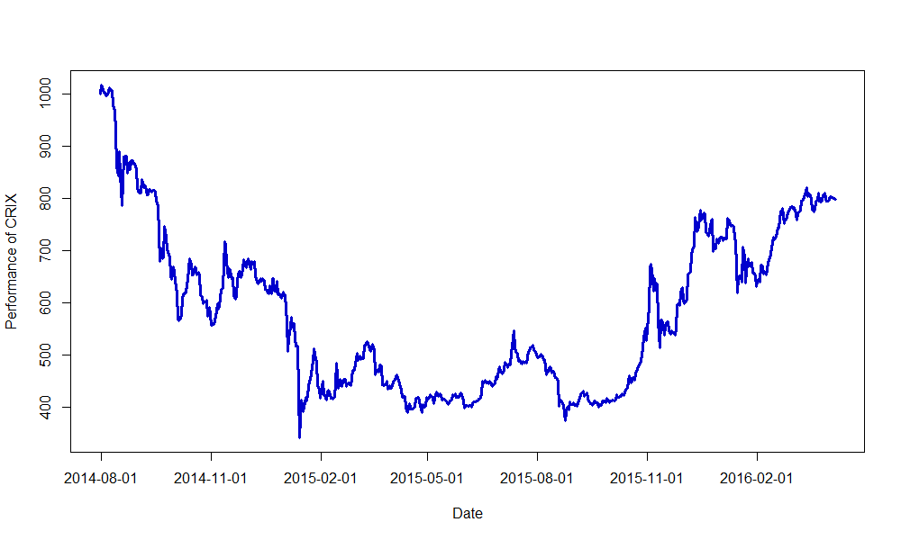

[](http://quantlet.de/index.php?p=info)

## [](http://quantlet.de/) **CRIXindex** [](http://quantlet.de/d3/ia)

```yaml

Name of Quantlet : CRIXindex

Published in : CRIX - a CRyptocurrency IndeX

Description : CRIXindex gives a plot which shows the performance of the cryptocurrency index CRIX.

Keywords : CRIX, index, cryptocurrency, crypto, plot

See also : 'ECRIXindex, EFCRIXindex, CRIXfamdiff, CRIXfamdiffloss, DAXCRIXloss, CRIXhnoptions,
CRIXoutmarket, CRIXoutmarketTERES, CRIXvarreturn'

Author : Simon Trimborn

Submitted : Fri, February 26 2016 by Simon Trimborn

Datafile : crix.csv

Example : Plot with the CRIX.

```




```r
rm(list = ls(all = TRUE))
graphics.off()

# please change your working directory 
# setwd('C:/...')

crix              = read.csv("crix.csv", header = FALSE)
crix$V1           = as.character(crix$V1)
last_substr       = substr(crix$V1, (nchar(crix$V1[1]) - 4), (nchar(crix$V1[1]) - 3))
last_substr_which = which(last_substr != c(last_substr[-1], tail(last_substr, n = 1))) + 1
last_substr_which = c(1, last_substr_which)
names_crix        = crix$V1[last_substr_which]

plot(crix[, 2], type = "l", col = "blue3", xaxt = "n", lwd = 3, xlab = "Date", 
     ylab = "Performance of CRIX")
axis(1, at = c(last_substr_which, 550), label = c(names_crix, "2016-02-01"))
```
