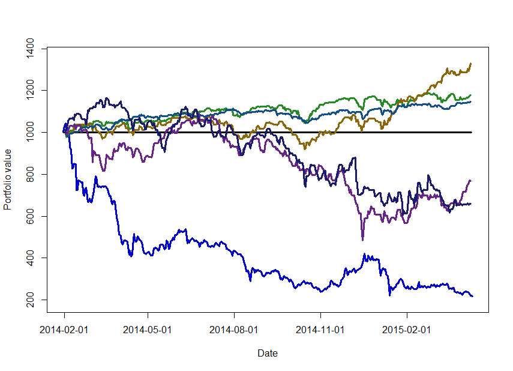

[](http://quantlet.de/index.php?p=info)

## [](http://quantlet.de/) **CRIXoutmarket** [](http://quantlet.de/d3/ia)

```yaml

Name of Quantlet : CRIXoutmarket

Published in : CRIX - a CRyptocurrency IndeX

Description : 'CRIXoutmarket gives a plot which shows the performance of the indices S&P500, DAX,
STI, RTSI and ATHEX against CRIX.'

Keywords : 'CRIX, index, cryptocurrency, crypto, plot, S&P500, btc, bitcoin, dax, sti, rtsi, athex,
performance'

See also : CRIXindex, CRIXhnoptions, CRIXoutmarketTERES, CRIXvarreturn

Author : Simon Trimborn

Submitted : Fri, December 04 2015 by Simon Trimborn

Datafile : crix.csv, SP500_index.csv, DAX_index.csv, STI_index.csv, RTSI_index.csv, ATHEX_index.csv

Example : Plot with S&P500, DAX, STI, RTSI, ATHEX and the CRIX.

```




```r
rm(list = ls(all = TRUE))
# please change your working directory 
# setwd('C:/...')

plot_crix   = read.csv("crix.csv", header = T, row.names = 1)
index_SP500 = read.csv("SP500_index.csv", header = T)
index_DAX   = read.csv("DAX_index.csv", header = T)
index_STI   = read.csv("STI_index.csv", header = T)
index_RTSI  = read.csv("RTSI_index.csv", header = T)
index_ATHEX = read.csv("ATHEX_index.csv", header = T)

line_index = rep(1000, dim(plot_crix)[1])
names(line_index) = rownames(plot_crix)
plot_xaxis = c(as.Date(rownames(plot_crix)[1]) - 1, 
  as.Date(rownames(plot_crix)))
plot(c(1000, plot_crix$Price), type = "l", col = "blue3", lwd = 3, 
  ylim = c(min(plot_crix, index_SP500, index_DAX, index_STI, index_RTSI, 
  index_ATHEX) - 30, max(plot_crix, index_SP500, index_DAX, index_STI, 
  index_RTSI, index_ATHEX) + 30), xlab = "Date", ylab = "Portfolio value", 
  xaxt = "n")
axis(1, at = c(2, 91, 183, 275, 367), 
  labels = plot_xaxis[c(2, 91, 183, 275, 367)])
lines(line_index, type  = "l", lwd = 3)
lines(index_SP500, type = "l", lwd = 3, col = "forestgreen")
lines(index_DAX, type   = "l", lwd = 3, col = "darkgoldenrod4")
lines(index_STI, type   = "l", lwd = 3, col = "dodgerblue4")
lines(index_RTSI, type  = "l", lwd = 3, col = "darkorchid4")
lines(index_ATHEX, type = "l", lwd = 3, col = "midnightblue") 

```
