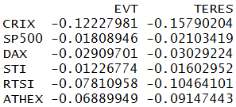

[](http://quantlet.de/index.php?p=info)

## [](http://quantlet.de/) **CRIXoutmarketTERES** [](http://quantlet.de/d3/ia)

```yaml

Name of Quantlet : CRIXoutmarketTERES

Published in : CRIX - a CRyptocurrency IndeX

Description : 'CRIXoutmarketTERES provides a matrix which shows the risk of S&P500, DAX, STI, RTSI
and ATHEX against CRIX measured by Expected Shortfall, estimated by an Extreme Value Approach (EVT)
and Tail Event Risk Expected Shortfall (TERES)'

Keywords : 'CRIX, index, cryptocurrency, crypto, plot, S&P500, btc, bitcoin, TERES, EVT, dax, sti,
rtsi, athex, expected shortfall'

See also : CRIXindex, CRIXhnoptions, CRIXoutmarket, CRIXvarreturn

Author : Simon Trimborn

Submitted : Fri, December 04 2015 by Simon Trimborn

Datafile : crix.csv, SP500_index.csv, DAX_index.csv, STI_index.csv, RTSI_index.csv, ATHEX_index.csv

Example : Matrix with the EVT and TERES result for S&P500, DAX, STI, RTSI, ATHEX and the CRIX.

```




```r

```
