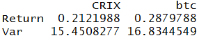

[](http://quantlet.de/index.php?p=info)

## [](http://quantlet.de/) **CRIXvarreturn** [](http://quantlet.de/d3/ia)

```yaml

Name of Quantlet : CRIXvarreturn

Published in : CRIX - a CRyptocurrency IndeX

Description : 'CRIXvarreturn computes a matrix which compares the absolut return and the variance,
computed by a GARCH(1,1) model, of a CRIX and Bitcoin (btc) time series.'

Keywords : CRIX, index, cryptocurrency, crypto, btc, bitcoin, returns, variance, garch

See also : CRIXindex, CRIXhnoptions, CRIXoutmarket, CRIXoutmarketTERES

Author : Simon Trimborn

Submitted : Fri, December 04 2015 by Simon Trimborn

Datafile : crix.csv, btc_index.csv

Example : A matrix with return and variance for btc and the CRIX.

```




```r
rm(list = ls(all = TRUE))
# please change your working directory 
# setwd('C:/...')

# install and load packages
libraries = c("fGarch")
lapply(libraries, function(x) if (!(x %in% installed.packages())) {
  install.packages(x)
})
lapply(libraries, library, quietly = TRUE, character.only = TRUE)

plot_crix = read.csv("crix.csv", header = T, row.names = 1)
plot_btc  = read.csv("btc_index.csv", header = T, row.names = 1)

return_CRIX = plot_crix$Price[dim(plot_crix)[1]]/plot_crix$Price[1]
return_btc  = plot_btc$Price[dim(plot_btc)[1]]/plot_btc$Price[1]

var_CRIX = sum(volatility(garchFit(~garch(1, 1), data = diff(log(plot_crix$Price)), 
  trace = F)))
var_btc  = sum(volatility(garchFit(~garch(1, 1), data = diff(log(plot_btc$Price)), 
  trace = F)))

erg = matrix(c(return_CRIX, return_btc, var_CRIX, var_btc), ncol = 2, nrow = 2, 
  byrow = T, dimnames = list(c("Return", "Var"), c("CRIX", "btc")))
erg 

```
