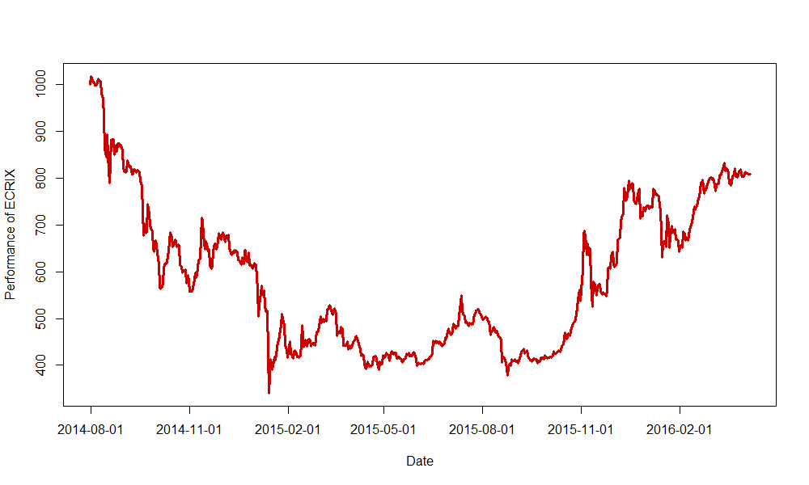

[](http://quantlet.de/index.php?p=info)

## [](http://quantlet.de/) **ECRIXindex** [](http://quantlet.de/d3/ia)

```yaml

Name of Quantlet : ECRIXindex

Published in : CRIX - a CRyptocurrency IndeX

Description : 'ECRIXindex gives a plot which shows the performance of the cryptocurrency index
ECRIX.'

Keywords : CRIX, ECRIX, index, cryptocurrency, crypto, plot

See also : 'CRIXindex, EFCRIXindex, CRIXfamdiff, CRIXfamdiffloss, DAXCRIXloss, CRIXhnoptions,
CRIXoutmarket, CRIXoutmarketTERES, CRIXvarreturn'

Author : Simon Trimborn

Submitted : Fri, February 26 2016 by Simon Trimborn

Datafile : ecrix.csv

Example : Plot with the ECRIX.

```




```r
rm(list = ls(all = TRUE))
graphics.off()

# please change your working directory 
# setwd('C:/...')

ecrix = read.csv("ecrix.csv", header = FALSE)
ecrix$V1 = as.character(ecrix$V1)
last_substr = substr(ecrix$V1, (nchar(ecrix$V1[1]) - 4), 
    (nchar(ecrix$V1[1]) - 3))
last_substr_which = which(last_substr != c(last_substr[-1], tail(last_substr, 
    n = 1))) + 1
last_substr_which = c(1, last_substr_which)
names_crix = ecrix$V1[last_substr_which]

plot(ecrix[, 2], type = "l", col = "red3", xaxt = "n", lwd = 3, xlab = "Date", 
     ylab = "Performance of ECRIX")
axis(1, at = c(last_substr_which, 550), label = c(names_crix, "2016-02-01"))
```
