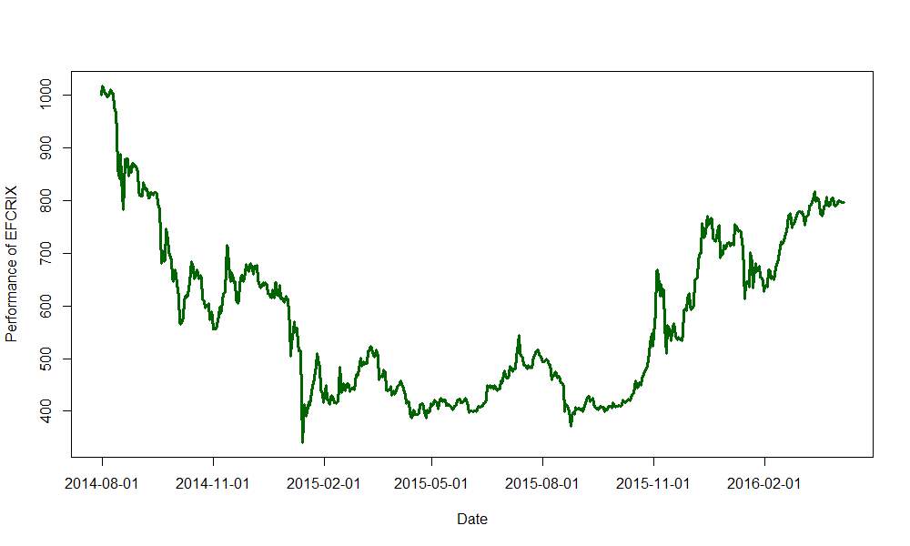

[](http://quantlet.de/index.php?p=info)

## [](http://quantlet.de/) **EFCRIXindex** [](http://quantlet.de/d3/ia)

```yaml

Name of Quantlet : EFCRIXindex

Published in : CRIX - a CRyptocurrency IndeX

Description : 'EFCRIXindex gives a plot which shows the performance of the cryptocurrency index
EFCRIX.'

Keywords : CRIX, ECRIX, EFCRIX, index, cryptocurrency, crypto, plot

See also : 'CRIXindex, ECRIXindex, CRIXfamdiff, CRIXfamdiffloss, DAXCRIXloss, CRIXhnoptions,
CRIXoutmarket, CRIXoutmarketTERES, CRIXvarreturn'

Author : Simon Trimborn

Submitted : Fri, February 26 2016 by Simon Trimborn

Datafile : efcrix.csv

Example : Plot with the EFCRIX.

```




```r
rm(list = ls(all = TRUE))
graphics.off()

# please change your working directory 
# setwd('C:/...')

efcrix            = read.csv("efcrix.csv", header = FALSE)
efcrix$V1         = as.character(efcrix$V1)
last_substr       = substr(efcrix$V1, (nchar(efcrix$V1[1]) - 4), 
    (nchar(efcrix$V1[1]) - 3))
last_substr_which = which(last_substr != c(last_substr[-1], tail(last_substr, 
    n = 1))) + 1
last_substr_which = c(1, last_substr_which)
names_crix        = efcrix$V1[last_substr_which]

plot(efcrix[, 2], type = "l", col = "darkgreen", xaxt = "n", lwd = 3, 
     xlab = "Date", ylab = "Performance of EFCRIX")
axis(1, at = c(last_substr_which, 550), label = c(names_crix, "2016-02-01"))
```
